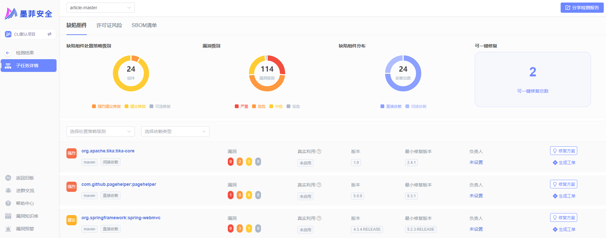
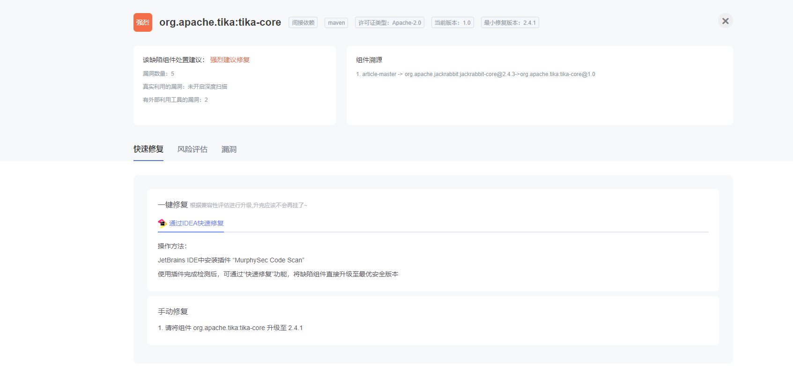

[中文](README_ZH.md) | EN

**MurphySec CLI** is used for detecting vulnerable dependencies from the command-line, and also can be integrated into your CI/CD pipeline.

<p>

  <a href="https://www.oscs1024.com/cd/1522831757949284352">
    
  </a>
  <a href="https://github.com/murphysecurity/murphysec">
    
  </a>


  <a href="https://github.com/murphysecurity/murphysec/blob/master/LICENSE">
    
  </a>
  
  
  </p>

## Features
1. Analyze dependencies being used by your project, including direct and indirect dependencies
2. Detect known vulnerabilities in project dependencies


### Screenshots

- CLI scan result

  
 
- scan result page

  
  


## Table of Contents
1. [Supported languages](#supported-languages)
2. [How it works](#how-it-works)
3. [Working Scenarios](#working-scenarios)
4. [Getting Started](#getting-started)
5. [Command Introduction](#command-introduction)
6. [Communication](#communication)
7. [License](#license)


## Supported languages

Currently supports Java, JavaScript, Golang. Other development languages will be gradually supported in the future.

Want to learn more about language support? [check out our documentation](https://www.murphysec.com/docs/faqs/quick-start-for-beginners/programming-language-supported.html)


## How it works
1. MurphySec CLI obtains the dependency information of your project mainly by building the project or parsing the package manifest files.

1. The dependency information of the project will be uploaded to the server, and the dependencies with security issues in the project will be identified through the vulnerability knowledge base maintained by MurphySec.


> Note: MurphySec CLI will only send the dependencies and basic information of your project to server for identifying the dependencies with security issues, and will not upload any code snippets.


## Working Scenarios
1. To detect security issues in your code locally
2. To detect security issues in CI/CD pipeline 

[Learn how to integrate MurphySec CLI in Jenkins](https://www.murphysec.com/docs/faqs/integration/jenkins.html)


## Getting Started

### 1. Install MurphySec CLI
Visit the [GitHub Releases](https://github.com/murphysecurity/murphysec/releases/latest) page to download the latest version of  MurphySec CLI, or install it by running:

#### Linux

```
wget -q https://s.murphysec.com/release/install.sh -O - | /bin/bash
```
#### OSX

```
curl -fsSL https://s.murphysec.com/release/install.sh | /bin/bash
```

#### WINDOWS

```
powershell -Command "iwr -useb https://s.murphysec.com/release/install.ps1 | iex"
```


### 2. Get access token

> MurphySec CLI requires an access token from your MurphySec account for authentication to work properly. [What is an access token?](https://www.murphysec.com/docs/faqs/project-management/access-token.html) 

Go to [MurphySec platform - Access Token](https://www.murphysec.com/console/set/token), click the copy button after the Token, then the access token is copied to the clipboard.


### 3. Authentication
There are two authentication methods available: `Interactive authentication` and `Parameter authentication`

#### Interactive authentication
Execute `murphysec auth login` command and paste the access token.

> If you need to change the access token, you can repeat this command to overwrite the old one.

#### Parameter Authentication
Specify the access token for authentication by adding the `--token` parameter


### 4. Detection
To perform detection using the `murphysec scan` command, you can execute the following command.

```bash
murphysec scan [your-project-path]
```

Available parameters

- `--token`: Specify the access token
- `--log-level`: Specify the log level to be printed on the command line output stream, no log will be printed by default, optional parameters are `silent`, `error`, `warn`, `info`, `debug`
- `--json`: Specify the output of the result as json format, not showing the result details by default

### 5. View results
MurphySec CLI does not show the result details by default, you can view the results in [MurphySec platform](https://www.murphysec.com/console).


## Command Introduction

### murphysec auth

Mainly used for the management of certification

```
Usage:
  murphysec auth [command]

Available Commands:
  login
  logout
```

### murphysec scan

Mainly used to run detections

```
Usage:
  murphysec scan DIR [flags]

Flags:
  -h, --help   help for scan
      --json   json output

Global Flags:
      --log-level string      specify log level, must be silent|error|warn|info|debug
      --no-log-file           do not write log file
      --server string         specify server address
      --token string          specify API token
  -v, --version               show version and exit
      --write-log-to string   specify log file path

```

## Communication

Contact our official WeChat account, and we'll add you into the group for communication. 


## License
[Apache 2.0](LICENSE)
